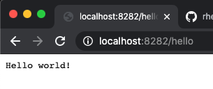

When I last used Go, version 1.9.7, dealing with dependencies was a real pain. I've just come from a project where we used `glide` to manage our dependencies and `go dep` was introduced. I was pleasantly surprised that since then the languages adopted modules. I am so excited to be able to dump some of my findings on using `go mod` here. Lets go! 😁

## 🔥 Please always use `go mod init` 🔥

It is a good habit to get into thinking about Go as a modular language. When you create your project folder, do a quick `go mod init` to get you going.

There are a couple of things to look out for. Running `go mod init` will name the module according to your current working directory. This may not be what you want. You can be explicit about your package name by passing it as the last argument.

``` bash
# Uses current working directory as module name.
go mod init 

# Define the module name explicitly.
go mod init github.com/<username>/<reponame>
```

## `go.mod` and `go.sum`

When you initiate your Go project a new `go.mod` file will be generated with just the module name and the target Go version. As you start to add additional imports this file will be updated with modules and versions. More on that below.

Because our code doesn't currently have any dependencies, it's looking a bit empty. So let's create a quick server endpoint. I could use `http`, but that would not help me with my explanation. I'll use good old, Gorilla Mux as my router.

``` bash
go get -u github.com/gorilla/mux
```

Now my `go.mod` file is updated and a `go.sum` file is generated. For the most part you don't ever really need to care about `go.sum`. This is used by Go to help reference the included modules (and their dependencies), which **LOOK** no longer lives in `vendors`. Yes!!!  It now lives inside your `GOPATH` in `pkg/mod`.

Something else you will see is that your dependency is now added to your `go.mod` file. If they are unused, you will see them with an `// indirect` comment.

Once you use the dependency the comment will disappear. Let's write our `main.go` file.

``` go
// main.go
package main

import (
	"fmt"
	"net/http"

	"github.com/gorilla/mux"
)

func main() {
	r := mux.NewRouter()
	r.HandleFunc("/hello", func(w http.ResponseWriter, r *http.Request) {
		fmt.Fprint(w, "Hello world!\n")
	})

	http.ListenAndServe(":8282", r)
}
```

Now run `go run main.go` to start the server.

Result:

  

## Tidying with Super Powers! 🦹‍♀️🦹🏽‍♂️🦸🏽‍♀️🦸‍♂️

When you `run`, `build` or `test` your project your require statements in `go.mod` will automatically update. But that is not the only way to update your dependencies. From time to time you might just want to run the `go mod tidy` command. Not only will redundancies be removed, but Go will also attempt to pull in dependencies.

``` bash
# Update dependencies.
go mod tidy
```

## Gotcha! Semantic import versioning.

When you use `go get` to import a module it is subject to Semantic Versioning. The short of it is that while you develop, versions starting with `0.` is considered to be your unstable **v0** version. When you have a `1.0.0` release you are considered to be at **v1**want. `2.x.y` becomes **v2**, `3.x.y` becomes **v3**. etc.

This scheme also suggests that all releases within a major version be backwards compatible for all releases in that version. `1.4.2` should be backwards compatible all the way down to `1.0.0`. Makes sense to me. 

But the gotcha comes when using `go get`. It will attempt to download your latest **v0/v1** version. So if your latest version is **v4.1.2** for example, `go get` will still pull your latest **v1** release. 🤯  What?!

To `go get` your "real" latest version, v4.1.2 in the example, you need to include the major version in your `go get` command. 

``` bash
go get -u github.com/example/project/v4 
```

I'm still struggling to get my head around it, but please read the docs on this one to avoid this pretty big caveat: [Module compatibility and semantic versioning](https://golang.org/cmd/go/#hdr-Module_compatibility_and_semantic_versioning)

Thankfully, Go was kind enough to let us see which versions are available using `go list`. But, it doesn't work on old projects that still have a `vendor` directory.

``` bash 
$ go list -m -versions github.com/example/project
github.com/example/project v0.1.0 v1.2.3, v2.3.4, v3.4.5, v4.0.0, v4.1.2
```

If you've been using different Docker Machine releases this semantic versioning is not that new, but when you start to code using modules in Go it can easily trip you up. 

That's all I have for this post. There is lots more to explore, but this should get you going.
