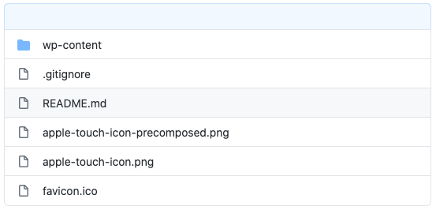

The following repo structure have worked really well for me:

  

Inside `.gitignore` I use the [template as provided by WP Engine](https://wpengine.com/wp-content/uploads/2020/02/recommended-gitignore-no-wp.txt) as a starting point with some minor modifications. [Here is my gist](https://gist.github.com/rheinardkorf/f053202364fe98ea3f27312d398d09ca).

Assuming you clone your repo into your WordPress root, you will need to update your local `wp-config.php` to use the repo rather than normal `wp-content`.

This example assumes a multisite, but not that hard to adjust for single site. It also assumes you cloned into `wpe-site`. Add the following to `wp-config.php`.

``` php
define( 'WP_CONTENT_DIR', __DIR__ . '/wpe-site/wp-content/' );
define( 'WP_CONTENT_URL', 'http://' . DOMAIN_CURRENT_SITE . '/wpe-site/wp-content' );
define( 'UPLOADS', './wpe-site/wp-content/uploads/' );
```

## Setting up the remotes

To deploy to the diffent environments we typically have 3 remotes. They look something like this: `my-site-slug`, `my-site-slugstaging`, `my-site-slugdev`.

Lets hook 'em up:

``` bash
# Develop
git remote add my-site-slugdev git@git.wpengine.com:production/my-site-slugdev.git

# Staging
git remote add my-site-slugstaging git@git.wpengine.com:production/my-site-slugstaging.git

# Production
git remote add my-site-slug git@git.wpengine.com:production/my-site-slug.git
```

## Deploying the branches  

Choose a branch for each environment. I'll go with `prod`, `staging` and `develop`. 

Here is how we deploy:

``` bash
# Development
git push my-site-slugdev develop:master

# Staging
git push my-site-slugstaging staging:master

# Production
git push my-site-slug prod:master
```
